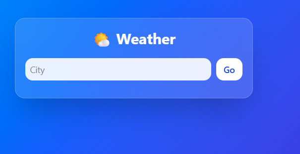
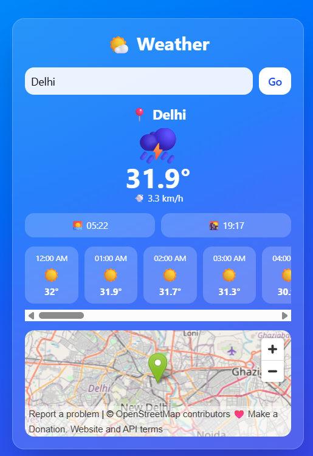
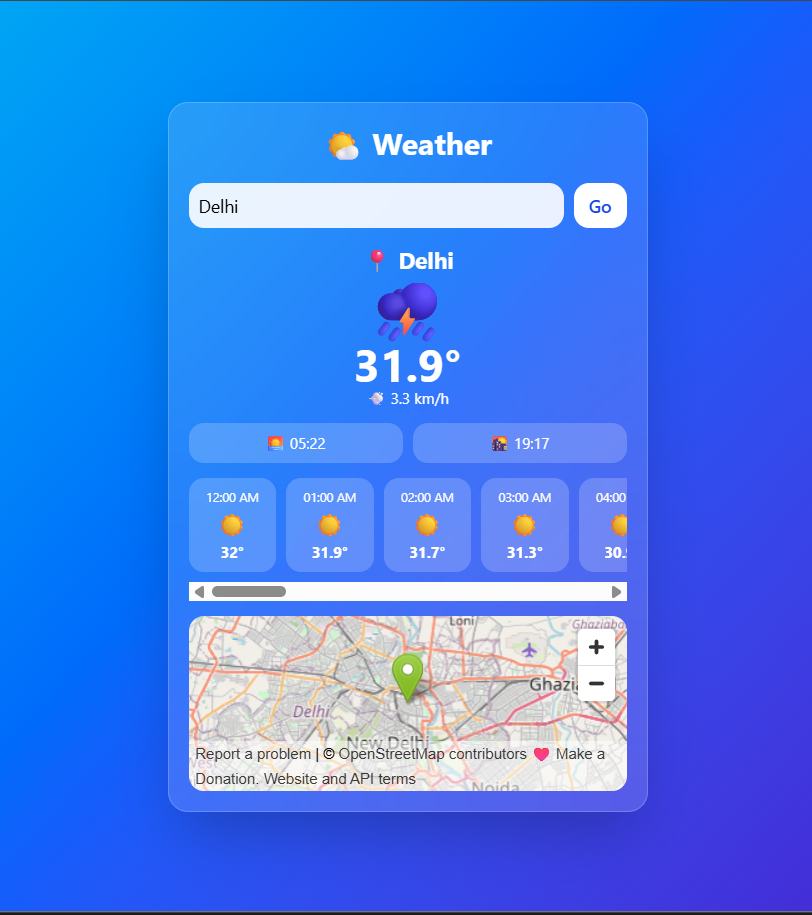

# 🌦️ Weather React App

A modern weather application built using **React.js** that provides real-time weather updates for any city using the OpenWeather API. The app displays temperature, weather conditions, humidity, and location-based forecasts in a clean and responsive UI.

---

## 🚀 Live Demo

```text
https://weatherreact-flame.vercel.app/
```

---

## 📌 Project Overview

This Weather App allows users to:

- Search weather by city name
- Get real-time temperature updates
- View weather conditions (sunny, cloudy, rain, etc.)
- Check humidity and wind details
- Experience responsive UI across devices

This project was built to improve skills in **React development, API integration, and state management**.

---

## ✨ Features

### 🌍 Weather Search
- Search any city worldwide
- Instant weather results using API

### 🌡️ Real-Time Data
- Current temperature
- Weather condition description
- Humidity and wind speed

### 📱 Responsive UI
- Mobile-friendly design
- Clean and modern layout
- Fast loading interface

### ⚡ API Integration
- OpenWeather API integration
- Dynamic data fetching

---

## 🛠️ Tech Stack

### Frontend
- React.js
- JavaScript (ES6+)
- CSS3 / Tailwind (if used)

### API
- OpenWeather API

### Tools
- Git
- GitHub
- VS Code

---

## 🏗️ Architecture

```text
User Input (City Name)
        │
        ▼
React Component
        │
        ▼
API Request (OpenWeather)
        │
        ▼
Weather Data Response
        │
        ▼
UI Update (Display Weather)
```

---

## 📂 Project Structure

```bash
weatherreact/

src/
│
├── components/
│   ├── WeatherCard.jsx
│   ├── SearchBar.jsx
│   └── WeatherDetails.jsx
│
├── services/
│   └── weatherAPI.js
│
├── App.js
├── index.js
└── styles.css
```

---

## ⚙️ Installation

### 1. Clone Repository
```bash
git clone https://github.com/Arunimatechy/weatherreact.git
cd weatherreact
```

### 2. Install Dependencies
```bash
npm install
```

### 3. Run Project
```bash
npm start
```

App runs at:
```text
http://localhost:3000
```

---

## 🔐 Environment Variables

Create a `.env` file:

```env
REACT_APP_API_KEY=your_openweather_api_key
REACT_APP_BASE_URL=https://api.openweathermap.org/data/2.5/weather
```

---

## 🎯 Learning Outcomes

This project helped me improve:

- React functional components
- API integration using Axios/fetch
- State management using hooks
- Handling asynchronous data
- UI responsiveness
- Project structuring in React

## 📸 Screenshots

### 🏠 Home Page



Clean and modern weather search interface for finding weather information by city.

---

### 🌦️ Weather Results



Displays real-time temperature, weather conditions, humidity, and wind speed.

---

### 📱 Mobile View



Responsive design optimized for mobile devices and tablets.

---

## 🚀 Future Improvements

- 7-day forecast feature
- Geolocation-based weather
- Dark mode support
- Weather animations
- Save favorite cities
- Hourly weather updates

---

## 👨‍💻 Developer

### Arunima

Full Stack Developer

### Skills Used
- React.js
- JavaScript
- REST API
- CSS
- Git & GitHub

GitHub:
https://github.com/Arunimatechy

---

## 🌟 Why I Built This Project

I built this project to strengthen my React skills and understand how to integrate real-world APIs. It helped me learn asynchronous data handling, component-based design, and building responsive user interfaces.

---

## ⭐ Support

If you like this project, consider giving it a ⭐ on GitHub.
